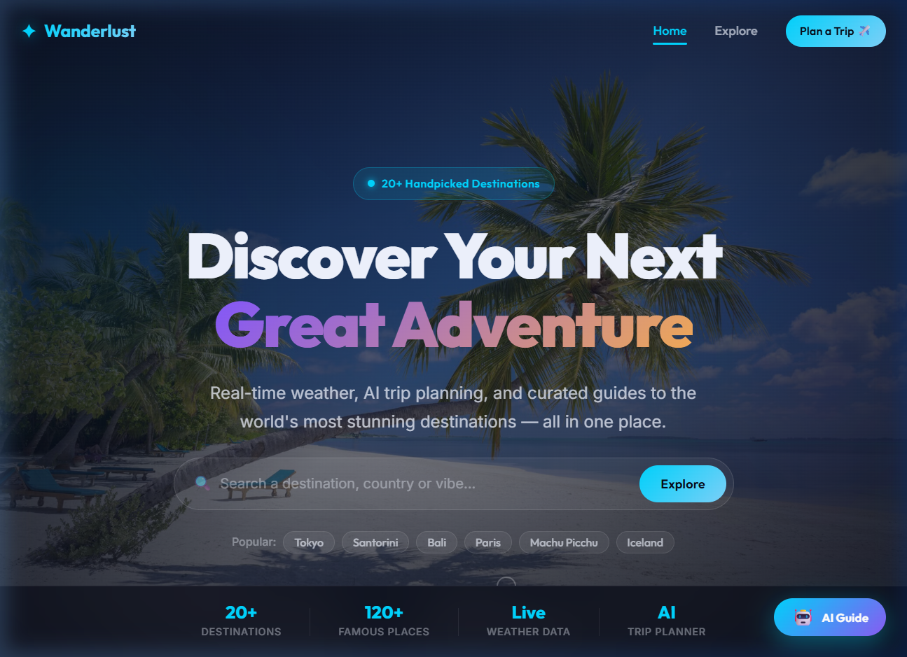
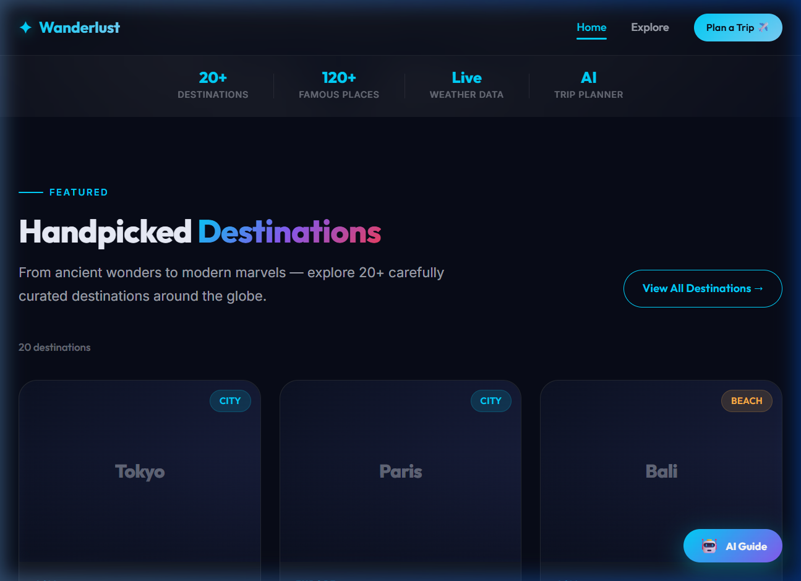
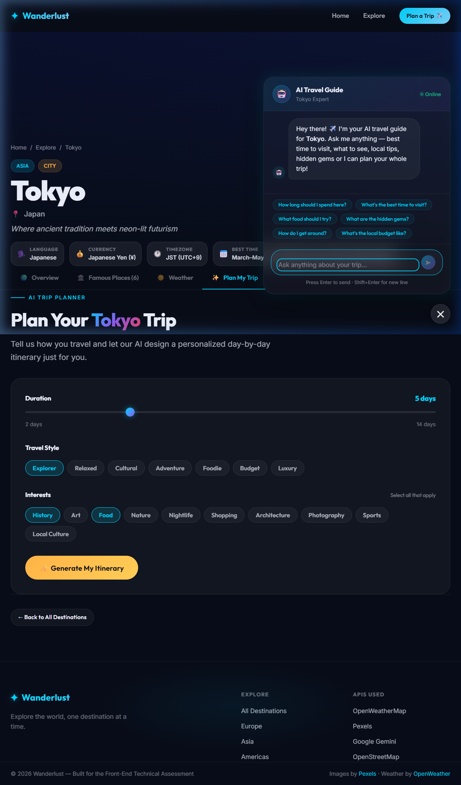
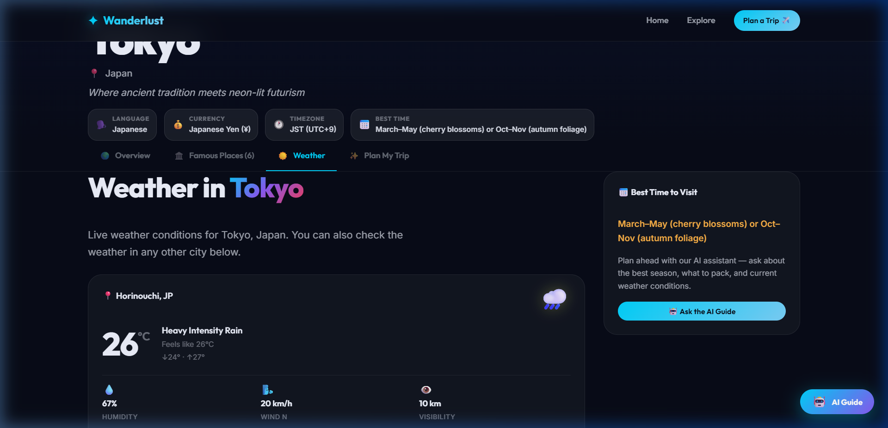
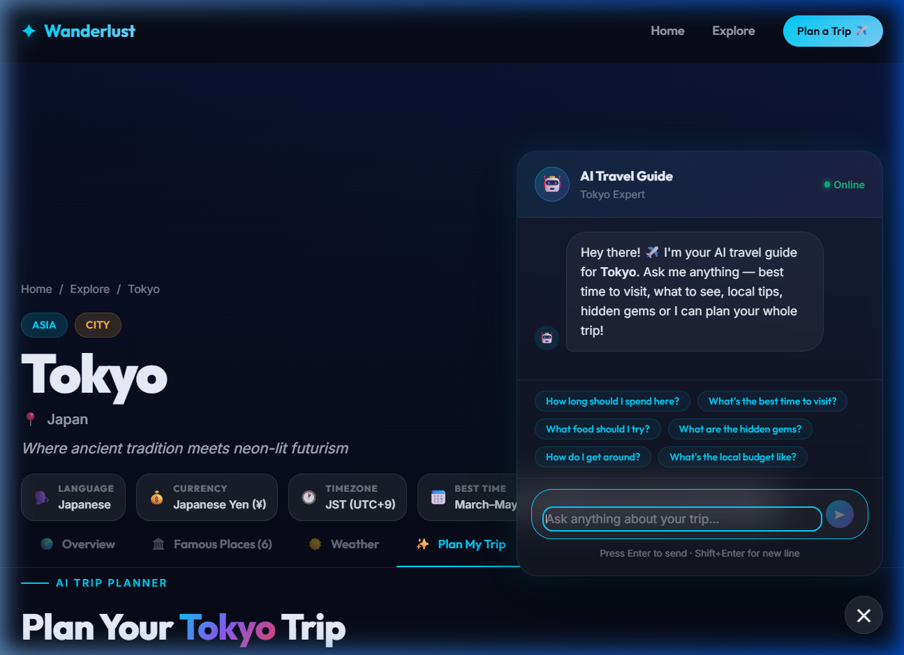
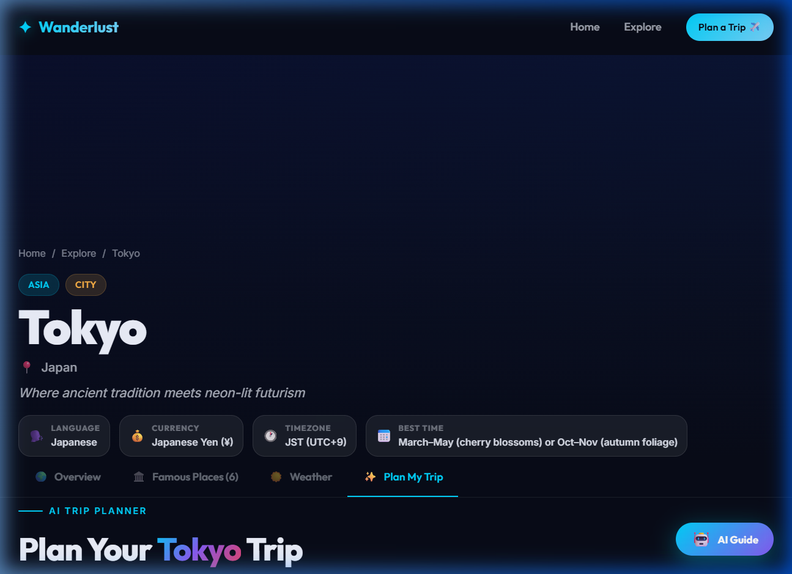

# ✦ Wanderlust — Travel Web Application

A premium, design-led travel web application that helps you explore destinations around the world, see live weather, discover famous places, and plan trips with an AI assistant.

Built for the **Front-End Developer Technical Assessment**.

---

## 🚀 Live Demo

> Deploy to Vercel: see deployment instructions below.

---

## 📸 Screenshots

| Hero | Destinations | Destination Page |
|------|-------------|-----------------|
|  |  |  |

| Weather | AI Chat | Itinerary |
|---------|---------|-----------|
|  |  |  |

---

## ✨ Features Built

### 01 — Hero Landing Experience
- Full-viewport looping background video (Mixkit)
- Animated headline with gradient text
- Glass-morphic search bar with popular destination chips
- Animated scroll indicator
- Stats bar (20+ destinations, 120+ places, live weather, AI)

### 02 — Destination Explorer
- 20+ handpicked destinations across 6 continents
- Real-time search (fuzzy match on name, country, tags, type)
- Filter chips by continent and destination type
- Empty state with clear message and reset CTA
- Skeleton loading cards while images fetch

### 03 — Famous Places
- Each destination has 6 curated famous places
- Rich place cards with Pexels images, category badges, descriptions
- Hover zoom effect and glassmorphic cards

### 04 — Location Awareness
- Browser Geolocation API prompt with permission states
- Graceful fallback message when permission is denied
- Manual city search using OpenStreetMap Nominatim (no API key required)
- Location-aware weather on the homepage

### 05 — Real-Time Weather
- Live weather via OpenWeatherMap API
- Displays: temperature, feels like, min/max, humidity, wind speed & direction, visibility, pressure, sunrise/sunset
- Search any city for weather from the widget
- Weather emoji icons per condition code
- Mock data fallback when no API key is set

### 06 — Images (Pexels API)
- All images fetched live from Pexels at runtime — zero hardcoded URLs
- Response caching to avoid duplicate requests
- Lazy loading with IntersectionObserver
- Graceful image error fallback with gradient placeholder
- Fallback to Unsplash URL pattern when Pexels key is missing

### 07 — AI Chatbot
- Floating action button (bottom-right), accessible on all pages
- Destination-aware: when on a destination page, Gemini knows the location context
- Suggested question chips for quick-start conversation
- Typing indicator (animated dots)
- Graceful error handling with mock responses as fallback

### 08 — Itinerary Planning
- Form: duration slider (2–14 days), travel style chips, interest tags
- Google Gemini generates structured JSON itinerary
- Rendered as a beautiful day-by-day timeline — NOT as chat text
- Time-of-day colour coding: Morning (amber), Afternoon (blue), Evening (violet)
- Dining recommendations per day
- Pro tips summary card
- Print/PDF support via CSS print styles

---

## 🛠️ Tech Stack

| Layer | Technology |
|-------|-----------|
| Framework | React 19 + Vite 8 |
| Routing | React Router v7 |
| Styling | Vanilla CSS + CSS Custom Properties |
| Typography | Google Fonts (Outfit + Inter) |
| Weather API | OpenWeatherMap |
| Images | Pexels API |
| AI | Google Gemini 1.5 Flash |
| Geocoding | OpenStreetMap Nominatim (free, no key) |
| Hero Video | Mixkit (free stock video) |

---

## 🌍 Destinations Included

Tokyo · Paris · Bali · New York City · Santorini · Machu Picchu · Dubai · Kyoto · Cape Town · Iceland · Amalfi Coast · Maldives · Queenstown (NZ) · Marrakech · Rio de Janeiro · Barcelona · Prague · Singapore · Swiss Alps · Petra (Jordan)

---

## 🔑 APIs Used

| API | Purpose | Key Required |
|-----|---------|-------------|
| [OpenWeatherMap](https://openweathermap.org/api) | Live weather data | Yes (free tier) |
| [Pexels](https://www.pexels.com/api/) | Destination & place images | Yes (free) |
| [Google Gemini](https://aistudio.google.com) | AI chatbot + itinerary | Yes (free tier) |
| [Nominatim / OSM](https://nominatim.openstreetmap.org) | Geocoding & reverse geocoding | No |
| [Mixkit](https://mixkit.co) | Hero background video | No |

---

## ⚙️ Running Locally

### 1. Clone the repository
```bash
git clone https://github.com/your-username/wanderlust-travel-app.git
cd wanderlust-travel-app
```

### 2. Install dependencies
```bash
npm install --legacy-peer-deps
```

### 3. Set up environment variables
```bash
cp .env.example .env
```

Edit `.env` and add your API keys:
```env
VITE_OPENWEATHER_API_KEY=your_openweather_api_key_here
VITE_PEXELS_API_KEY=your_pexels_api_key_here
VITE_GEMINI_API_KEY=your_gemini_api_key_here
```

> **Note:** The app works without API keys using mock/fallback data. All three keys are needed for full live functionality.

### 4. Start the development server
```bash
npm run dev
```

Visit `http://localhost:5173`

---

## 🚢 Deployment (Vercel)

1. Push your repository to GitHub (ensure `.env` is in `.gitignore`)
2. Import the project on [Vercel](https://vercel.com)
3. Add environment variables in Vercel Dashboard → Settings → Environment Variables:
   - `VITE_OPENWEATHER_API_KEY`
   - `VITE_PEXELS_API_KEY`
   - `VITE_GEMINI_API_KEY`
4. Deploy

---

## 📁 Project Structure

```
src/
├── components/
│   ├── chatbot/        # ChatBot, ItineraryPlanner, ItineraryRenderer
│   ├── destinations/   # DestinationCard, DestinationGrid
│   ├── hero/           # HeroSection
│   ├── layout/         # Navbar, Footer
│   ├── places/         # PlaceCard
│   ├── ui/             # LoadingSpinner, ErrorState
│   └── weather/        # WeatherWidget
├── data/
│   └── destinations.js # 20 destinations with 6 famous places each
├── hooks/
│   ├── useGeolocation.js
│   ├── useImages.js
│   └── useWeather.js
├── pages/
│   ├── HomePage.jsx
│   ├── ExplorePage.jsx
│   └── DestinationPage.jsx
├── services/
│   ├── geminiService.js
│   ├── geocodingService.js
│   ├── pexelsService.js
│   └── weatherService.js
└── styles/
    ├── globals.css     # Design system, tokens, utilities
    └── animations.css  # Keyframes, animation classes
```

---

## 🎨 Design Decisions

- **Dark-mode first** with deep navy (`#080c18`) as the base
- **Glassmorphism** cards using `backdrop-filter: blur` and semi-transparent fills
- **Purposeful motion** — animations tied to load events and user interactions, not decorative
- **Teal/cyan primary** (`#00d4ff`) + **gold accent** (`#ffb347`) + **violet secondary** (`#8b5cf6`)
- **Outfit** (display/headings) + **Inter** (body) typography from Google Fonts
- Every error, loading, and empty state is a **designed component**, not an afterthought

---

## ♿ Accessibility

- Semantic HTML5 elements (`<main>`, `<nav>`, `<article>`, `<section>`, `<aside>`)
- Skip-to-main-content link
- ARIA roles and labels on all interactive elements
- `aria-live` regions for dynamic content (weather, chat messages, search results)
- Keyboard-navigable throughout
- `focus-visible` rings on all focusable elements
- WCAG AA colour contrast on all text

---

## 🔒 Security

- API keys stored in environment variables only
- `.env` is git-ignored — never committed
- `.env.example` provided for reference without real values
